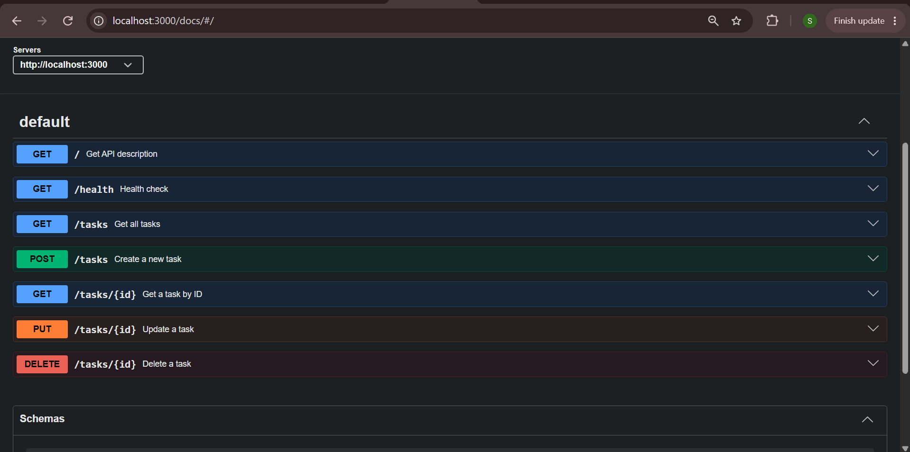
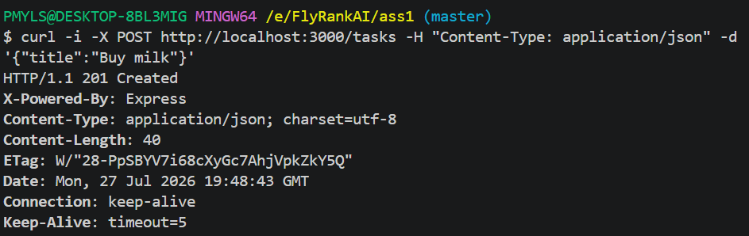

# Task API

A simple RESTful Task API built with **Node.js** and **Express.js**. The API supports creating, retrieving, updating, and deleting tasks (CRUD operations). It also includes interactive API documentation using **Swagger UI** following the **OpenAPI 3.0** specification.

---

## Technologies Used

- Node.js
- Express.js
- Express Router
- Swagger UI Express
- OpenAPI 3.0
- Git & GitHub

---

## Project Structure

```text
ASS1/
│
├── images/
│   ├── curl_output.png
│   └── swagger.png
│
├── node_modules/
│
├── src/
│   ├── controllers/
│   │   └── CRUDcontrollers.js
│   │
│   ├── routes/
│   │   └── CRUDRoutes.js
│   │
│   ├── app.js
│   └── swagger.json
│
├── package.json
├── package-lock.json
└── README.md
```

---

# Getting Started

## Prerequisites

Before running this project, make sure you have the following installed:

- Node.js
- npm (comes with Node.js)

You can verify your installation by running:

```bash
node -v
npm -v
```

---

## Installation

### 1. Clone the repository

```bash
git clone https://github.com/Sofia284-code/CRUD_APIs.git
```

### 2. Navigate to the project directory

```bash
cd CRUD_APIs
```

### 3. Install all project dependencies

```bash
npm install
```

This command automatically installs all required packages defined in `package.json`, including:

- Express
- Swagger UI Express

No additional installations are required.

### 4. Start the server

```bash
node src/app.js
```

If the server starts successfully, you should see:

```text
Example app listening on port 3000
```

---

# Running the API

Base URL

```
http://localhost:3000
```

Swagger Documentation

```
http://localhost:3000/docs
```

---

# API Endpoints

| Method | Endpoint | Description |
|---------|----------|-------------|
| GET | `/` | Get API description |
| GET | `/health` | Check server health |
| GET | `/tasks` | Retrieve all tasks |
| GET | `/tasks/{id}` | Retrieve a task by ID |
| POST | `/tasks` | Create a new task |
| PUT | `/tasks/{id}` | Update an existing task |
| DELETE | `/tasks/{id}` | Delete a task |

---

# Example curl Request

Create a new task:

```bash
curl -i -X POST http://localhost:3000/tasks -H "Content-Type: application/json" -d '{"title":"Buy milk"}'
```

Example Response

```http
HTTP/1.1 201 Created
X-Powered-By: Express
Content-Type: application/json; charset=utf-8
Content-Length: 40
ETag: W/"28-PpSBYV7i68cXyGc7AhjVpkZkY5Q"
Date: Mon, 27 Jul 2026 19:48:43 GMT
Connection: keep-alive
Keep-Alive: timeout=5

{"id":4,"title":"Buy milk","done":false}
```

---

# Screenshots

## Swagger UI



---

## curl Output



---

# HTTP Status Codes

| Status Code | Description |
|-------------|-------------|
| 200 | Request completed successfully |
| 201 | Resource created successfully |
| 204 | Resource deleted successfully |
| 400 | Invalid request |
| 404 | Resource not found |

---

# Features

- Create tasks
- Retrieve all tasks
- Retrieve a task by ID
- Update task title and completion status
- Delete tasks
- Proper HTTP status codes
- Input validation
- Interactive API documentation using Swagger UI